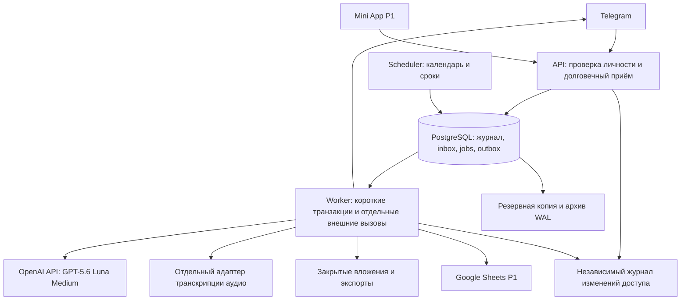

# Архитектура финансового трекера

Версия 0.7, 12 сентября 2026 года. Статус: архитектурная основа P0 зафиксирована для реализации; ADR-17 закрепляет выбранную пользователем GPT-5.6 Luna Medium через OpenAI API. Это решения проекта, а не отчёт об испытаниях работающей системы.

Документ конкретизирует [ТЗ](TZ.md), включая совместные бюджеты, комментарии, AI и произвольные повторяющиеся периоды. Ограничения схемы описаны в [контракте данных](DATA_CONTRACT.md), результаты аудита и условия готовности — в [архитектурном ревью](ARCHITECTURE_REVIEW.md). Продуктовые требования FR сохраняют силу; при неоднозначности технического механизма применяются решения ADR этого документа. Изменение ADR оформляется новой записью с причиной, последствиями и миграцией, а не молчаливой заменой.

## 1 Границы и выбранная конструкция

P0 — один модульный сервер с одной основной PostgreSQL, приватным объектным хранилищем и отдельными процессами приёма, фонового исполнения и планирования. Telegram — основной интерфейс. База приложения является источником финансовых данных. Импорт и экспорт файлов входят в P0; синхронизация Google Sheets и Mini App остаются P1.

Нагрузка и задержки из раздела 23 ТЗ — цели будущего измерения. Выбор подходит для начального семейного использования и проверяется на 10 бюджетах по 5 участников. Количество строк в таблице, параллельных AI запросов и задач доставки измеряется отдельно от числа пользователей.



Резервные копии и журнал доступа не являются второй финансовой базой. Их восстановление и сроки хранения различаются по ADR-14.

## 2 Реестр решений

| ID | Зафиксированное решение | Причина и цена решения |
|---|---|---|
| ADR-01 | Модульный монолит; API, worker и scheduler из одного артефакта | Одна транзакция для денег и плана; проще выпуск. Требуется контроль зависимостей модулей |
| ADR-02 | Python 3.13, aiogram 3, FastAPI, Pydantic 2, SQLAlchemy 2.0, psycopg 3, Alembic; PostgreSQL 17 | Асинхронные интеграции и строгий серверный контракт; версии исправлений закрепляются при сборке |
| ADR-03 | Версии финансовой операции и неизменяемые движения счетов | Исправление воспроизводимо; отчёт по текущей версии не суммирует историю исправлений |
| ADR-04 | READ COMMITTED и блокировка строки бюджета для финансовых и административных изменений | Предсказуемая конкуренция в семье; записи одного бюджета выполняются последовательно |
| ADR-05 | Durable inbox, PostgreSQL jobs, outbox; доставка минимум один раз | Нет дополнительного брокера в P0; аренды, повторы и остановки необходимо испытать |
| ADR-06 | Серверная авторизация на каждом действии плюс RLS для изоляции строк | Права не зависят от видимости кнопки; RLS страхует пропущенный фильтр бюджета |
| ADR-07 | Календарные даты, исключённая правая граница, версии политики и шаблона | Цикл 10–9 и фиксированные дни имеют точный смысл; смена календаря не переписывает историю |
| ADR-08 | AI создаёт типизированное предложение; деньги проводит доменный сервис | Модель не получает SQL, доступы или право самостоятельно менять бюджет |
| ADR-09 | Точные SQL агрегаты и версионированные снимки для AI | Числа проверяемы; AI не вычисляет остатки по пересказу переписки |
| ADR-10 | Единые команды для Telegram, API, ручного ввода и импорта | Исправления и права одинаковы во всех интерфейсах |
| ADR-11 | Приватное хранилище; скачивание через сервер с проверкой доступа | Ранее выданная ссылка не обходит отзыв членства |
| ADR-12 | Ограниченная конкуренция, явные квоты, отдельные классы задач | Массовый анализ не задерживает ручной ввод и не расходует неограниченный бюджет AI |
| ADR-13 | Один регион, управляемая PostgreSQL с PITR, контейнерные процессы | Небольшой объём эксплуатации; конкретные регион и поставщик выбираются до размещения данных |
| ADR-14 | Восстановление в закрытом режиме с независимым журналом доступа | Старый backup не возвращает удалённые бюджеты, отозванных участников или прежнего администратора |
| ADR-15 | Миграции с совместимостью соседних выпусков, проверки на настоящей PostgreSQL | Откат приложения не требует разрушительного отката денежных данных |
| ADR-16 | Изменять архитектуру по измеренному ограничению | Отдельные сервисы, Redis и аналитическое хранилище появляются только по конкретному основанию |
| ADR-17 | GPT-5.6 Luna, reasoning.effort=medium, напрямую через OpenAI Responses API | Явный выбор пользователя; один профиль LLM/vision и анализа, отдельный ASR |

Это выбранные решения для данного приложения. Ссылки на документацию подтверждают свойства инструментов; выбор их сочетания и параметры ниже являются инженерным решением проекта.

## 3 ADR-01–02: модули, стек и зависимости

| Модуль | Единственный владелец записи | Что предоставляет остальным |
|---|---|---|
| identity_access | Пользователи, членства, приглашения, передача роли, удаление | ActorContext, проверку прав, протокол изменения доступа |
| onboarding | Личные мастера и публикация бюджета | Возобновляемую настройку и согласованный начальный план |
| ingestion | Inbox, вложения, логические сообщения, вопросы и черновики | Кандидатов с происхождением и версией |
| catalog | Категории, люди, получатели, метки, правила | Проверенные справочники внутри бюджета |
| ledger | Операции, ревизии, распределения, движения счетов, возвраты | Единственный путь проведения и исправления денег |
| planning | Политики дат, периоды, версии плана, переносы | Определение периода и действующие лимиты |
| commitments_goals | Расписания, экземпляры, требования, цели, резервы | Остатки обязательств и защищённых сумм |
| analytics | Полнота, сверки, запросы отчётов, снимки | Числовое основание с областью и версией |
| intelligence | Провайдеры, попытки AI, предложения, обратная связь | Предложения классификации и оптимизации |
| integrations | Импорт, экспорт, соединения с внешними таблицами | Проверенные пакеты и независимый статус выгрузки |
| delivery | Outbox consumers, персональные доставки, предпочтения | Повторы и результат отправки каждому участнику |
| platform | Unit of Work, очередь, часы, конфигурация, телеметрия | Технические примитивы без финансовых правил |

Telegram handlers и HTTP endpoints преобразуют запрос в команду application слоя. Application слой проверяет доступ и координирует модули в одной Unit of Work. Domain слой содержит денежные и календарные правила без зависимости от Telegram, SQLAlchemy, FastAPI и конкретной модели AI. Infrastructure реализует репозитории и внешние адаптеры. Минимальное общее ядро: ID, Money, Currency, DateRange, ActorContext и типизированные ошибки.

Другой модуль не выполняет произвольный UPDATE чужой таблицы. Согласованная запись распределения, счёта, резерва и исполнения платежа выполняется через их интерфейсы в одной транзакции, без промежуточных commit. Асинхронные события используются для доставки, выгрузки и анализа; целостность денег не зависит от своевременной обработки outbox.

Сборка: один репозиторий, один контейнерный образ, команды запуска api / worker / scheduler. Зависимости закрепляются uv.lock; миграции — Alembic; проверки — pytest, Hypothesis для инвариантов денег/дат, Ruff и mypy. Патч-версии и digest образа фиксируются при первом техническом запуске после проверки совместимости. Их совместимость пока не испытана. PostgreSQL 17 выбрана как поддерживаемая стабильная линия; использовать актуальный безопасный minor, план обновления major пересматривать ежегодно. [Политика поддержки PostgreSQL](https://www.postgresql.org/support/versioning/)

P0 не вводит полный Event Sourcing, CQRS с отдельной базой, микросервисы, Kafka, Redis, Celery, Kubernetes или собственную векторную базу. История ревизий и outbox решают конкретные требования аудита и повторов. Семантический поиск и retrieval по личной истории не нужны для фильтров категорий и заметок первой версии.

## 4 ADR-03: финансовая запись и исправление

Операция имеет постоянный ID и указатель на актуальную неизменяемую ревизию. Ревизия хранит сумму, дату, тип, распределения, комментарий, автора изменения и причину. Автор исходной записи сохраняется отдельно. Только ledger создаёт AccountEntry. Операция, её ревизия, движения, изменения резервов/исполнения, счётчики версий и outbox сохраняются одним commit.

Денежное исправление добавляет точные обратные движения к последнему действующему финансовому эффекту и новые движения для исправленного состояния. Старые строки не переписываются. Отмена добавляет обратные движения; восстановление создаёт новую ревизию и повторно проверяет действительность счетов, категорий, возвратов и прав. Изменение только заметки или человека создаёт ревизию без нового движения денег. Наличие возврата ограничивает отмену/уменьшение исходной покупки: сначала нужен согласованный план исправления связанных записей.

Баланс счёта — сумма всех его подписанных записей, включая начальный остаток и обратные движения. Отчёт расходов — сумма расходных распределений только текущих проведённых ревизий плюс возвраты по правилам ТЗ. Эти запросы различаются намеренно. Общая сумма смешанного платежа не равна его потребительской части.

Модель хранит несколько движений для одной операции. В интерфейсе P0 у обычной покупки один выбранный счёт либо явно неизвестный способ оплаты. Несколько способов оплаты в одном чеке не проводятся автоматически: остаются черновиком до уточнения поддерживаемого способа. Публичный сценарий нескольких источников оплаты — отдельное расширение после P0; инфраструктура нескольких движений нужна уже для переводов.

Счёт имеет режим full_tracking / reference. Первый предполагает начальную точку и весь поток, второй служит указанием способа оплаты без обещания фактического остатка. Неизвестный счёт не создаёт банковского баланса. Личная карта, по которой записываются только общие покупки, по умолчанию reference. Изменить режим можно через сверку и явную начальную точку. В показателях доступных денег учитываются только пригодные по полноте и ликвидности счета; неполная область делает общую оценку ограниченной.

Деньги, пришедшие в общий бюджет с личного счёта вне его охвата, — внешнее пополнение с отдельным назначением, а не автоматически заработанная зарплата. Между двумя включёнными счетами это перевод. Категории, принадлежность счёта и имя покупателя не создают долги между участниками сами по себе. Контракты возвратов, частичных оплат и сверки детализированы в DATA_CONTRACT.

## 5 ADR-04: транзакции и одновременные действия

Основной уровень изоляции записи — READ COMMITTED. Все команды, меняющие финансовые данные, справочники, план, календарь или доступ, сначала блокируют соответствующий Workspace через SELECT FOR UPDATE. Затем перечитывают актуальное членство, поколение доступа, состояние бюджета и expected_version объекта. Изменения разных бюджетов не блокируют друг друга. Частный черновик, не влияющий на общий учёт, использует собственную версию.

Порядок блокировок: workspace → membership / invite → изменяемые агрегаты по фиксированному типу и ID. Команды P0 не изменяют деньги двух бюджетов сразу. При будущем появлении такой команды бюджеты блокируются в порядке ID. Любая фоновая запись следует тому же порядку. Отзыв доступа сериализуется с записью: завершённый ранее отзыв запрещает проведение; ранее проведённая операция остаётся общей.

Схема команды:

1. Проверить форму, личность и предварительную доступность объекта.
2. Открыть транзакцию, установить локальный RLS контекст, заблокировать бюджет.
3. Проверить актуальные права, версии, состояние и существующий ключ идемпотентности.
4. Если результат уже есть, проверить совпадение хэша команды и вернуть его после текущей авторизации.
5. Выполнить доменные проверки, вставить все финансовые изменения и outbox, обновить версии.
6. Commit; только затем разрешить отправку подтверждения.

Внутри транзакции запрещены AI, Telegram, объектное хранилище, ожидание пользователя и тяжёлое декодирование. Дорогой расчёт производится заранее, затем под блокировкой проверяется версия основы. Ошибка expected_version даёт конфликт без автоматического перетирания. Deadlock / serialization failure повторяет всю безопасную транзакцию до 3 раз с jitter; внешние действия в повтор не попадают. Lock timeout возвращает временную занятость.

Начальные ограничения конфигурации: lock_timeout 2 s, statement_timeout 5 s для обычных команд, 10 s для отчёта, idle_in_transaction_session_timeout 10 s. Для принятого ограниченного пакета импорта/слияния допустим отдельный statement_timeout 60 s и общий deadline транзакции 90 s; пользователю показана временная занятость записи бюджета. Это стартовые пределы, а не измеренные задержки. Цель короткой обычной транзакции под блокировкой — p95 до 100 ms на целевой среде; при нарушении исследуются запросы и размер пакета.

READ COMMITTED не даёт единого снимка нескольким SELECT. Поэтому многозапросный отчёт читает короткую read-only транзакцию REPEATABLE READ; один SQL агрегат может использовать снимок одного запроса. Ответ модели создаётся уже после освобождения соединения. Перед выдачей длительно подготовленного результата доступ проверяется ещё раз. [Изоляция PostgreSQL](https://www.postgresql.org/docs/17/transaction-iso.html), [блокировки строк](https://www.postgresql.org/docs/17/explicit-locking.html)

## 6 ADR-05: inbox, очередь, outbox

Webhook FastAPI проверяет Telegram secret header, допустимый тип, размеры и личность. До 2xx сохраняет InboundEvent и первую Job одной транзакцией; повтор update возвращает подтверждение существующего приёма. Финансовый контекст закрепляется при приёме. /start и приглашения проходят специальный маршрут без отправки кодов в AI.

aiogram используется для типов, маршрутизации сохранённого Update и Telegram клиента в worker. Его обработчик с немедленным ответом и in-process фоновой обработкой не заменяет долговечный inbox. FastAPI BackgroundTasks также не используется для проведения, распознавания, доставки и очистки, от которых требуется восстановление после падения процесса. [aiogram webhook](https://docs.aiogram.dev/en/latest/dispatcher/webhook.html), [FastAPI BackgroundTasks](https://fastapi.tiangolo.com/tutorial/background-tasks/)

Job имеет тип и версию payload, бюджет, ссылку на предмет, logical_key, available_at, attempts, lease_token, lease_until, состояние и ограниченный срок исполнения. Очередь хранится в PostgreSQL. Исполнитель в короткой транзакции выбирает готовые строки через FOR UPDATE SKIP LOCKED, присваивает случайный token аренды и освобождает соединение. Работа во внешней системе идёт вне транзакции. Результат принимается только при совпадении действующего lease_token, состояния, версии предмета и актуальных полномочий. Просроченный исполнитель не может завершить уже переарендованную задачу. [Назначение SKIP LOCKED](https://www.postgresql.org/docs/17/sql-select.html)

Аренда по умолчанию 120 s, продление каждые 30 s, один внешний запрос имеет timeout не более 90 s. CPU работа вынесена в отдельный ограниченный процесс, чтобы не блокировать продление. Истечение аренды допускает повтор, а не объявляет успешным незавершённый вызов. Отмена AI может быть лишь best effort; защита записи обеспечивается версией и token.

Состояния: queued → running → succeeded; running → retry_wait → running; running → failed / cancelled. Истёкшая running возвращается в доступные после проверки lease. Начальный retry backoff: 2, 10, 30, 120, 600 s с jitter ±20%, максимум 6 попыток вместе с исходной. Для провайдерского 429 учитывается retry_after. Интерактивное распознавание автоматически прекращает попытки через 10 минут и предлагает продолжить тот же черновик вручную. Доставка может повторяться до 24 часов; устаревшие финансовые предупреждения пересчитываются или объединяются. Постоянные ошибки не повторяются автоматически.

Outbox создаётся в транзакции предметного изменения. Отдельная отметка (event_id, consumer) исключает повтор эффекта конкретного потребителя. Раскрытие общей аудитории создаёт независимые NotificationDelivery; ключ — (event_id, recipient_user_id, membership_generation, channel). Автор подтверждения использует ту же логическую доставку, а не второй независимый sendMessage. Перед отправкой проверяются членство, поколение и состояние бюджета. Ушедший автор не отменяет общие расписания, но его личные черновики и доставки прекращаются.

Для order-sensitive потребителей сохраняются aggregate_revision и workspace event_seq. Старый экспорт не заменяет новый; устаревший анализ не выдаётся как текущий. Уведомление о конкретной операции показывает её сохранённую ревизию; уведомление об остатке перечитывает актуальные числа. Рассылка нескольким людям не удерживает финансовую блокировку.

Пороговые события имеют отдельный UNIQUE(workspace,period,budget_line,threshold_type). Их состояние обновляется с финансовой/плановой командой под workspace lock: прыжок 70→105% создаёт только верхнее актуальное предупреждение, возврат или новая версия плана не сбрасывают историю порогов. Глобальный лимит проактивных сообщений применяется атомарно к (recipient,local_day) в личном часовом поясе пользователя по всем бюджетам. Резервация слота выполняется отдельной короткой транзакцией после предметного расчёта, без удержания workspace lock; неопределённый результат отправки слот не освобождает автоматически. Ответы автору и уведомления о совместных правках имеют отдельный класс по FR-53/86.

Транспорт гарантирует обработку минимум один раз. Единственность финансового эффекта обеспечивают уникальные ключи и транзакция. После неоднозначного сетевого ответа Telegram может повторить уведомление; универсальной гарантии «ровно одно сообщение» нет.

## 7 ADR-06: доступ и границы доверия

Личность берётся только из проверенного Telegram Update или серверной сессии. Имя, user_id, бюджет и роль из текста AI, формы или callback не являются доказательством права. На каждую команду проверяются активное членство, новое поколение после повторного вступления, роль и принадлежность всех связанных объектов. UUID бюджета — адрес объекта, приглашение — отдельный секрет, хранящийся как HMAC-SHA-256 с серверным ключом. Код не даёт роли admin.

Данные в PostgreSQL разделены по workspace_id; составные внешние ключи не позволяют связать операцию одного бюджета с категорией другого. Для таблиц бюджета включаются ENABLE и FORCE ROW LEVEL SECURITY. Runtime роли не являются владельцами таблиц, superuser или BYPASSRLS. Владелец миграций не используется приложением. [PostgreSQL RLS](https://www.postgresql.org/docs/17/ddl-rowsecurity.html)

RLS в этом проекте обеспечивает **изоляцию выбранного пространства**, а серверная авторизация — **право выбрать это пространство и выполнить действие**. Не заявляется защита RLS от полностью скомпрометированного сервера, способного устанавливать произвольный контекст. Запросы параметризованы. Политики сравнивают строковый workspace_id с доверенно установленным app.workspace_id; для личных черновиков, настроек и исходного голоса дополнительно проверяют app.user_id. Нет универсального флага bypass для worker.

Контекст задаётся через транзакционный set_config с is_local=true после получения соединения; отсутствие контекста закрывает доступ. По окончании транзакции он не переносится следующему пользователю из пула. API и worker используют отдельные ограниченные роли. Worker получает бюджет и тип полномочия из захваченной Job; пользовательская задача повторно проверяет действующего автора, системная имеет только разрешённую команду вроде открытия периода. Системный анализ читает общий подтверждённый журнал и обезличенный счётчик ожиданий, не содержимое чужих черновиков.

Технические глобальные таблицы inbox/job leases не содержат открытых финансовых payload: только маршрутизацию, ссылки и состояния. Payload хранится отдельно с защитой по владельцу/бюджету. Таблицы пользователей и первоначального мастера имеют политику «свой пользователь». Запрос bootstrap членства доступен только доверенному backend и возвращает минимальную собственную карту доступа. Клиенты никогда не соединяются с PostgreSQL напрямую.

Исключение для чтения bootstrap задано явно: SELECT собственных строк memberships разрешён по app.user_id без выбранного workspace; SELECT метаданных workspaces разрешён через собственное активное членство. Это не разрешение читать дочерний финансовый журнал без установленного контекста. INSERT/UPDATE/DELETE используют отдельные USING/WITH CHECK по выбранному workspace и не наследуют расширяющее правило чтения. Личный материал Attachment имеет visibility=owner; только прикреплённый подтверждённый чек переводится в workspace при ledger commit. Исходный голос остаётся owner.

Отдельные SECURITY DEFINER функции допустимы только для узкой подтверждённой необходимости: фиксированный безопасный search_path, минимальные права владельца, отозванный EXECUTE у PUBLIC, отдельные тесты. Общая функция «выполнить SQL от владельца» запрещена. [Правила SECURITY DEFINER](https://www.postgresql.org/docs/17/sql-createfunction.html)

При удалении / выходе прекращаются новые чтения, команды и выдачи. Уже отправленные байты или полученное Telegram сообщение невозможно отозвать атомарно с транзакцией базы. Для экспорта и фонового ответа членство проверяется непосредственно перед выдачей; этот предел гарантии отражается в пользовательской политике.

P1 Mini App: сервер проверяет initData по официальному алгоритму, auth_date не старше 5 минут, допустимое расхождение будущего времени до 30 s. Затем выдаёт случайную серверную сессию на 30 минут без права полагаться на старую роль. Для одноимённого HTTPS origin cookie HttpOnly / Secure / SameSite=Lax; изменяющие HTTP запросы требуют CSRF token и проверку Origin. Сессия не хранится в localStorage. При иной схеме embedding поведение cookie проверяется на Telegram iOS/Android/Desktop до выпуска P1. [Telegram Mini Apps](https://core.telegram.org/bots/webapps)

## 8 ADR-07: календарь и план

Введённый конец включён, в базе период — [start_date, end_date_exclusive). День операции — локальная дата бюджета; технические события хранятся UTC timestamptz. Для дневного/периодного агрегата точность сохраняется, время покупки не выдумывается.

Календарная политика содержит исходную опорную дату и день, число календарных месяцев либо число локальных дней. Следующая месячная граница вычисляется от исходного anchor и порядкового номера, с временным ограничением до последнего дня короткого месяца. Последующая граница не строится от уже обрезанного 28 февраля. Фиксированный день не равен 24 часам UTC при смене часового пояса.

Scheduler хранит следующую нужную границу как срок Job, а не создаёт отдельную cron запись на каждого участника. Открытие периода и проверка на чтении/записи вызывают один idempotent ensure_periods. При простое оно последовательно восстанавливает интервалы до нужной даты по историческим версиям. Запись никогда не идёт в случайно последний существующий период: сначала обеспечивается период своей даты. Дальние диапазоны восстанавливаются порциями, с сохранённым прогрессом.

Под блокировкой бюджета проверяются уникальность и смежность периодов, версия политики и уже подготовленный конкретный план. База дополнительно запрещает пересечения через exclusion constraint по workspace_id и daterange. Соседство и отсутствие дыр обеспечиваются календарным сервисом и deferred проверкой при изменении границ.

Порядок плана: утверждённый план конкретного периода → применимая утверждённая версия включённого шаблона → черновик без утверждённых лимитов. Дефицит помечается needs_review, но не блокирует открытие. Перенос предыдущего остатка отдельный и идемпотентный; он не становится частью базового шаблона. Расписания аренды и зарплаты имеют собственный cadence, независимый от недельного бюджета. Конец периода не означает полноту истории.

Изменение календаря или общего часового пояса администратором — новая будущая версия с предпросмотром перехода. Исторические локальные даты не пересчитываются. Для времени суток, попавшего в DST gap, уведомление отправляется в первый существующий момент после gap; при повторённом времени выбирается первый момент, повтор исключает logical_key. При невозможной локальной дате в выбранном поясе мастер показывает ошибку и просит изменить границу; дата не нормализуется скрыто.

## 9 ADR-08: AI и диалоги

Сменные интерфейсы сохранены, основной LLM/vision адаптер зафиксирован: прямой OpenAI Responses API, GPT-5.6 Luna, effort=medium по ADR-17. ASR остаётся отдельным адаптером; его транскрипт поступает в Luna. Ответы валидируются Pydantic и дополнительными доменными проверками: Money парсится из десятичной строки в minor units без float; ID сверяются со справочником; неизвестные поля и недопустимые типы не проходят. Строгий режим схемы сам по себе не проверяет денежный смысл и полномочия. [Pydantic strict mode](https://pydantic.dev/docs/validation/latest/concepts/strict_mode/)

Один источник имеет устойчивые Candidate ID. AI попытка хранит base_draft_version и fingerprint исходного материала. Ручное завершение открывает тот же черновик. После ручной правки, отмены, проведения или отзыва доступа поздний AI ответ не перезаписывает данные и не создаёт второй расход. Нужный результат можно показать как новое предложение с явным подтверждением.

Clarification связывает вопрос с draft_id, candidate_id, field и expected_version. Ответ на конкретную карточку привязан к нему. При нескольких подходящих незавершённых вопросах число «500» не отправляется в случайный. Новая законченная фраза о покупке создаёт отдельный ввод, не затирая мастер настройки. FSM библиотека не является единственным хранилищем состояния: всё необходимое для продолжения находится в PostgreSQL.

AI оптимизация получает снимок числовых показателей, ограниченную релевантную выборку и сведения о полноте. Модель возвращает объяснение и предложение из разрешённого набора действий. Изменение лимита, календаря, резерва или записи требует конкретной команды с подтверждённой версией. Сохранённые заметки, OCR и импорт — недоверенные данные. Произвольный SQL, URL fetch и инструменты изменения данных модели не предоставляются.

Версионируются адаптер, модель, промпт, JSON schema, правила и набор оценки. Измеряются отдельно сырой AI ответ, валидированный кандидат и проведённая запись. Известная ошибка автоматического проведения блокирует автозапись затронутого класса до исправления или режима подтверждения; процент точности на ограниченной выборке не разрешает заранее известную ошибку. Истёкший или неполный снимок требует воздержания либо явной оговорки области.

## 10 ADR-09–10: отчёты и интерфейсы

Формулы из ТЗ исполняются детерминированным доменным кодом/SQL. Общие чтения отделены от команд, но используют ту же основную базу. Read replica и отчётный кэш в P0 не нужны. Если кэш появится, он всегда содержит workspace и версии основы, а ответ после записи должен видеть как минимум подтверждённую пользователю ревизию.

Каждый отчёт содержит период или точные границы, currency, coverage, data_revision, метод, фильтры и время расчёта. Составной запрос получает один снимок. Рекомендация содержит revision вектора (деньги, план, календарь, справочники, полнота), чтобы изменение заметки не сбрасывало сверку счёта, но могло сделать текстовую рекомендацию неактуальной.

Фильтрация смешанной покупки выполняется на подходящих распределениях. Категория и получатель должны совпасть в одной части, а не в разных строках одной покупки. Фильтры автора, совершившего покупку и комментария применяются к операции. Метки проверяются через EXISTS, не размножающий суммы. Число уникальных покупок и сумма подходящих частей показаны отдельно от полного итога чека.

Пагинация журнала — keyset по occurred_date и ID; курсор подписан, связан с бюджетом, фильтрами и data_revision. При изменении основы между страницами сервер предлагает обновить выборку. Экспорт читает один зафиксированный снимок и не имитирует такой снимок последовательностью страниц изменяющегося журнала.

Серверная карта команд, прав, версий и уведомлений зафиксирована в DATA_CONTRACT. HTTP использует /v1; финансовые маршруты имеют явный бюджет в пути. Telegram вызывает те же application handlers напрямую, без HTTP запроса к самому себе. Полное OpenAPI генерируется из типов при реализации соответствующего среза, сравнивается с картой и проверяется в CI. Придумывание денежных правил откладывать до генерации OpenAPI нельзя.

## 11 ADR-11: вложения, импорт и удаление материалов

Object storage закрыт от публичного чтения. Ключи случайные, без имени человека, магазина и суммы. Метаданные содержат workspace/owner, фактический тип, размер, хэш, связь с источником и delete_after. Выдача идёт через авторизованный серверный endpoint; срок действия URL не заменяет проверку текущего членства. Telegram file URL и временные ключи не попадают в логи.

Загрузка файла и SQL commit не являются одной транзакцией. Используются staging → ready → deleting → deleted; после загрузки проверяется checksum, затем регистрируется готовый объект. Непривязанные staging объекты очищаются через 24 часа, удаление повторяется безопасно. Идемпотентный ключ загрузки предотвращает появление бесконечных копий. Совпадения файлов разных бюджетов не раскрываются друг другу.

Первичный лимит 15 MB на файл; изображение — до 40 мегапикселей и 16 384 пикселей по одной стороне; альбом — до 10 файлов и 60 MB суммарно. P0 принимает фото JPEG/PNG/WebP и голос Telegram до трёх минут по FR-13/14; PDF/архив не пытается автоматически исполнять или разбирать как чек. Конвертер запускается без сети, с пределом 1 CPU, 512 MiB и 30 s на файл; проверка заголовка/размеров предшествует полному декодированию. QR декодируется как данные; произвольные URL не открываются. Для получения файлов используются только разрешённые хосты интеграций с проверкой redirect и размера.

Дополнение к срокам ТЗ: сырой текст входящего сообщения, ASR transcript и детальный результат разбора — до 7 дней после завершения/отмены, незавершённый материал — до 7 дней с приёма. Остаются структурированная подтверждённая операция, выбранная заметка, минимальное происхождение и технический hash/ID. Полные prompts/responses не пишутся в технические логи. Более длительное хранение исходников включается явно и согласуется с политикой обработчика.

Импорт сначала создаёт приватный staging пакет с картой и отчётом сверки. Применение использует ledger и сохраняет источник каждой строки. Начальный P0 предел — 5 000 нормализованных операций в одном атомарном пакете; до запуска измерить длительность commit. Больший файл делится пользователем на независимые проверяемые пакеты; до принятия другого протокола нельзя показывать частично применённый большой пакет как целиком атомарный. Откат импорта создаёт согласованные отмены через ledger, не удаляет строки SQL в обход зависимостей.

## 12 ADR-12: нагрузка и бюджет внешних запросов

Классы задач: интерактивный ввод и доставка; календарь/обязательства; AI обзоры; импорт/экспорт; очистка. Отдельные пределы и справедливый выбор бюджетов не позволяют одному большому импорту занять всю обработку. Для малого пилота стартовые значения: до 4 интерактивных внешних AI вызовов и 1 обзора одновременно на сервис, до 2 AI вызовов на бюджет. Значения конфигурируются по результатам измерений; увеличение worker процессов не увеличивает общий лимит автоматически.

SQLAlchemy AsyncSession создаётся отдельно на задачу/запрос, не разделяется между asyncio.gather. Соединение не удерживается во время ожидания провайдера. Начальные пулы: API 5 + overflow 2, worker 5 + 2, scheduler 2 + 0 соединения на процесс. Суммарный верхний предел всех процессов и реплик должен оставлять резерв базы для миграций и восстановления; для начальной установки бюджет runtime соединений не более 30. [SQLAlchemy AsyncSession](https://docs.sqlalchemy.org/en/20/orm/extensions/asyncio.html)

Стоимость AI — сервисная квота, не категория семейных расходов. До запроса короткая транзакция атомарно резервирует верхнюю оценку стоимости по пределу входа и max_output_tokens; проверяются глобальный месячный лимит, лимит бюджета и число одновременных вызовов. Фактическая стоимость закрывает reservation, остаток освобождается. При неизвестном результате сумма остаётся зарезервированной до сверки с провайдером; повторный вызов требует новой резервации. Запрос без известной ограниченной цены не запускается автоматически. Валюта тарифов учитывается отдельно от валюты семейного журнала.

Расчётное окно сервисной квоты — календарный месяц UTC, независимый от периода семьи. Порядок блокировок квоты: строка общего сервисного лимита → строка квоты бюджета → reservation. Эти блокировки не удерживаются одновременно с финансовым workspace lock. Семафоры провайдерских вызовов учитываются на уровне сервиса в PostgreSQL, а не только в памяти отдельной реплики; сетевой timeout не доказывает, что провайдер прекратил обработку и не выставит счёт.

Лимиты изменяет оператор сервиса, семейный admin может только уменьшать свой разрешённый предел. При исчерпании квоты ручные расходы, исправления, календарь, числовые отчёты и экспорт продолжают работать. Разовая стоимость и число попыток сохраняются по запросу провайдера, не только по итоговому расходу.

Регистрация и членство — разные настройки. P0 поддерживает установленный в ТЗ сценарий /start → создать бюджет или войти по коду. Возможен режим закрытого пилота с allowlist создателей и приглашениями для остальных; включить его можно только как явную конфигурацию запуска с понятным сообщением пользователю. Он не подменяет право участников работать с уже общим бюджетом.

## 13 ADR-13: размещение и наблюдаемость

Production: один выбранный регион, TLS ingress, приватная управляемая PostgreSQL 17 с PITR, приватное object storage, контейнеры API/worker/scheduler. API принимает трафик только по HTTPS; база доступна только сервисам. Dev/test/prod имеют разные базы, ботов, бакеты и секреты. Персональные данные не копируются в тестовую среду по умолчанию.

Секреты поступают из secret manager выбранной среды, не из репозитория или образа. Webhook header secret отделён от токена Telegram. Проверяются ротация токена, ключа приглашений и ключа журналирования доступа с сохранением читаемости нужных старых записей. Доступ к резервным копиям не совпадает с правами обычного worker.

Миграция запускается один раз отдельным заданием перед новым кодом; каждый старт API не запускает DDL. Liveness показывает состояние процесса, readiness — возможность долговечно принять работу и совместимость схемы. Недоступность AI не выводит ручной API из readiness. При завершении процесс перестаёт брать задания, заканчивает короткие commit; остаток возвращается через истечение аренды.

Логи структурированы: correlation_id, event/job ID, тип команды, длительность, ошибка без payload. Метрики не используют user_id/workspace_id как неограниченные labels. Наблюдаются возраст inbox/jobs/outbox, число просроченных аренд, lock waits, пул, AI latency/error/cost, backlog очистки, расхождения баланса и фактическая доступность backup.

Начальные операционные сигналы: старейшая интерактивная задача >60 s в течение 5 минут; неработающее открытие периода >5 минут; рост failed jobs; последняя восстанавливаемая точка старше 30 минут; любой провал сверки денежных инвариантов; превышение срока удаления. Канал и ответственный оператор назначаются до пилота. Уведомления оператору не содержат текст частных расходов.

## 14 ADR-14: резервирование, отзыв и восстановление

Требования P0: RPO ≤1 час, RTO ≤4 часа, окно резервных копий 30 дней. Выбирается управляемый PITR или проверенный эквивалент с базовой копией и непрерывным архивом WAL. Ежедневная копия без журнала не выполняет RPO. Проверяется **последняя реально восстанавливаемая точка**, а не только факт успешного запуска backup. При самостоятельном архивировании контролируется задержка WAL и малый трафик; начальная цель доставки архива не более 5 минут. [PostgreSQL continuous archiving](https://www.postgresql.org/docs/17/continuous-archiving.html)

RPO допускает потерю части недавно подтверждённых данных при катастрофической утрате основной базы. Это не гарантия нулевой потери и не замена защите от потери события при обычном рестарте. При восстановлении фиксируется интервал возможной потери и выполняется сверка; нельзя тихо повторно провести неподтверждённый хвост входов или разослать восстановленные старые подтверждения.

Отдельный защищённый журнал доступа хранится в независимом от отката основной базы контуре — приватном версионируемом object storage с отдельными правами и ключом шифрования. Он содержит только технические ID, проверенную связь user ID с Telegram ID, поколения членств, роли, состояния и последовательность изменений; имён и финансовых сумм в нём нет. Это позволяет восстановить минимальную идентичность нового участника, даже если строка пользователя не попала в старый backup. Компонент восстановления не откатывает журнал вместе с PostgreSQL. Последний подтверждённый снимок доступа сохраняется, пока существует бюджет; старые записи и tombstone удаления — не короче окна потенциально старых backup плюс 7 дней.

Storage адаптер журнала обязан поддерживать проверяемое условное создание записи, согласованное чтение после записи и обнаружение последней подтверждённой версии. prepared/committed имеют отдельные неизменяемые ключи operation ID, digest и ссылку на предыдущую версию. Несовпадающий повтор не перезаписывает запись. При отсутствии доказуемой последней версии restore не открывает бюджет по устаревшему списку. Эти свойства выбранного хранилища проверяются до пилота; сам термин «object storage» их не доказывает.

Создание бюджета, вступление/повторное вступление, выход, исключение, изменение запрета входа, смена администратора и удаление проходят один протокол SecurityChange:

1. Короткая DB транзакция проверяет автора/версию и ставит fence изменения доступа для бюджета. Новые финансовые команды и выдачи для этого бюджета временно приостановлены.
2. Вне DB транзакции записывается долговечный prepared с operation ID, ожидаемой версией и новым снимком доступа. Повтор той же записи идемпотентен.
3. Под блокировкой бюджета проверяется тот же fence; изменения доступа атомарно применяются в DB. Fence пока сохраняется.
4. Вне DB транзакции журнал дополняется committed, связанным с prepared и проверенной применённой версией.
5. Короткая DB транзакция завершает SecurityChange и снимает fence; только после этого пользователь получает подтверждение завершения.

Для создания используется пока невидимый Workspace в состоянии draft. Для вступления квота приглашения и поколение членства изменяются в шаге 3 вместе. Код приглашения не попадает в журнал. Параллельная смена роли не обходит fence. Поколение доступа — случайный UUID, не счётчик, который может повториться после отката. Конечный администратор в active бюджете всегда один.

Сбой на промежуточном шаге возобновляется по operation ID. Prepared без доказанного commit при восстановлении означает карантин соответствующего бюджета; оно не является разрешением физически удалить данные или выдать новые права. Финальный committed применяется до открытия доступа. Если независимый журнал недоступен, изменение не объявляется завершённым; интерфейс показывает выполнение/ошибку, оператор получает сигнал. Физическая очистка удалённого бюджета запускается после завершённого протокола. Вызов хранилища никогда не удерживает DB lock.

Порядок восстановления: изолированная среда → PostgreSQL/PITR → закрытые исходящие очереди → независимый журнал доступа и удаления → сверка последних ACL версий и карантин неизвестных состояний → аннулирование старых сессий, приглашений и незавершённых предложений смены роли → проверка вложений/очистки и денежных инвариантов → сверка возможного потерянного интервала → разрешение доступа и запуск актуальных задач. Старый outbox не отправляется вслепую. Минимум раз до пилота и затем ежеквартально проводится полный учебный restore с замером RPO/RTO.

Этот протокол выбран из-за уже принятого требования не возвращать отозванный доступ из backup. Один асинхронный outbox в восстанавливаемой базе его не обеспечивает: подтверждённый отзыв мог бы исчезнуть вместе с последними данными.

## 15 ADR-15–16: выпуск, проверка и развитие

Первый вертикальный срез до подключения AI: создать бюджет → пригласить участника → вручную записать расход → исправить → открыть следующий период → получить одинаковый отчёт обоим. Он проверяет самые дорогие для последующей переделки решения.

Далее подключаются долговечный ввод и провайдеры через уже существующие команды. Для каждого среза CI проверяет lint/types, финансовые и календарные инварианты, реальные SQL constraints и RLS, API/Telegram маршруты и миграцию. Проверки транзакций, SKIP LOCKED и exclusion constraints выполняются на PostgreSQL 17, не на SQLite. Hypothesis генерирует последовательности исправлений, возвратов, отмен и даты коротких месяцев; отдельные конкурентные сценарии управляют моментом паузы процесса.

Миграции расширяют схему до переключения кода. Очередь и события имеют schema_version; поддерживаются текущий и предыдущий форматы на время выпуска. Удаление старых колонок — отдельный поздний шаг после окончания совместимости и резервного окна. Сгенерированная Alembic миграция проверяется вручную, особенно для RLS, индексов, триггеров и данных. Откат приложения предпочтительнее разрушительной down migration; исправление денежных данных проводится новым аудируемым действием.

До разработки ядра должны быть приняты ADR и контракты. До пилота должны быть **пройдены**, а не просто перечислены, проверки из ARCHITECTURE_REVIEW: деньги, роли, гонки, очередь, restore, нагрузка, AI и удаление. Пока реализации нет, их статус — «не выполнено».

Новый брокер рассматривается, когда возраст очереди растёт из-за подтверждённой конкуренции за PostgreSQL после оптимизации запросов. Более тонкие блокировки — когда измеренная очередь записи внутри одного бюджета нарушает SLO. Read replica/агрегаты — когда профиль показывает недостаточность индексов и bounded запросов. Отдельный AI сервис — когда ему нужен независимый цикл выпуска/ресурсы. Каждое изменение сохраняет ключи идемпотентности, авторизацию и денежные инварианты и сопровождается отдельным ADR.

Открытые решения о хостинге, регионе, ASR, точных пакетах и стоимости собраны в ARCHITECTURE_REVIEW. Основной AI провайдер и модель уже выбраны по ADR-17. Открытые решения не оставляют разработчику выбора между несовместимыми моделями денег, доступа или календаря.

## 16 ADR-17: выбранный AI профиль

Статус: принято по прямому указанию пользователя 12 сентября 2026 года. Назначение — извлечение и категоризация расходов из текста и фото, разбор транскриптов, ответы по готовым финансовым снимкам и периодическая оптимизация. [Официальная карточка GPT-5.6 Luna](https://developers.openai.com/api/docs/models/gpt-5.6-luna)

| Параметр | Зафиксированное значение |
|---|---|
| Провайдер и маршрут | OpenAI API напрямую |
| Base URL | https://api.openai.com/v1 |
| Endpoint | POST /responses |
| Model ID | gpt-5.6-luna |
| Reasoning effort | medium |
| Service tier первой версии | default — стандартная обработка |
| Серверный ключ | OPENAI_API_KEY через secret manager окружения |
| Структурированный результат | Схема извлечения/рекомендации и доменная валидация по ADR-08 |
| Голос | Отдельный ASR → текст → тот же профиль Luna Medium |

Обязательные параметры профиля запроса; input и схема результата добавляются по конкретному сценарию:

```json
{
  "model": "gpt-5.6-luna",
  "reasoning": {
    "effort": "medium"
  },
  "service_tier": "default"
}
```

Ключ доступен только серверному адаптеру. Он не передаётся в Telegram, Mini App, логи или исходный код. В текущем проекте фиксируется спецификация подключения; реальные ключи и оплачиваемые запросы для этого решения не нужны.

Конфигурация сервиса и фоновый worker используют один версионированный AIProfile. В ParseAttempt и AnalysisRun записываются profile_version, запрошенная модель, фактическая модель из ответа при наличии, effort, service_tier, usage, provider_request_id и стоимость. Имя Medium не дописывается к model ID.

Недоступность выбранной модели запускает предусмотренные повторы и ручное завершение; автоматический переход на другую модель, effort, OpenRouter или Flex/Fast не разрешён этим профилем. Изменение оформляется новым ADR и прогоном корпуса. Возможное изменение модели за стабильным API ID отслеживается по доступным метаданным, регрессиям и официальным обновлениям; этот ID сам по себе не обещает неизменность весов.

Выбор модели закрыт; её качество на наших текстах и чеках ещё проверяется по разделу 25 ТЗ и AR-36. Поиск «победителя» среди нескольких LLM больше не является обязательным предварительным этапом. Конкретная ASR модель, пригодность среды размещения и измеренная стоимость остаются задачами до пилота.
